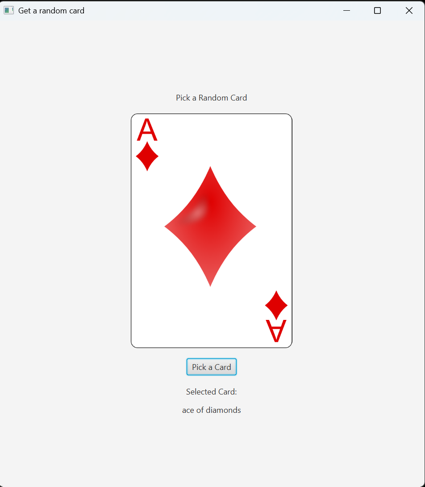

# Random Card Picker - JavaFX

## Overview

Random Card Picker is a JavaFX desktop application that randomly selects and displays playing cards using animated card transitions and image assets.

The application demonstrates GUI programming, event handling, animations, and image processing using JavaFX.

---

## Features

- Random card generation
- Animated card spinning effect
- JavaFX graphical user interface
- Image-based card display
- Button event handling
- Randomized suit and rank selection

---

## Technologies Used

- Java
- JavaFX
- OOP
- GUI Development
- Event Handling
- Animation (Timeline / KeyFrame)

---

## Screenshot

---

## Demo Video

[Watch Demo Video on YouTube](https://youtube.com/shorts/kfxC7nTMzL8?feature=share)
---

## How to Run

1. Install Java and JavaFX
2. Open the project in VS Code
3. Run `RandomCardPicker.java` using JavaFX

## Learning Outcomes

This project helped strengthen understanding of:

- JavaFX GUI development
- Java event handling
- Timeline animations
- Image loading
- Object-oriented programming
- Randomization logic
- Desktop application development

---

## Skills Demonstrated

- Object-Oriented Programming (OOP)
- GUI Development
- JavaFX
- Event-Driven Programming
- Animation Programming
- Image Handling
- Randomization Logic
- Software Documentation
